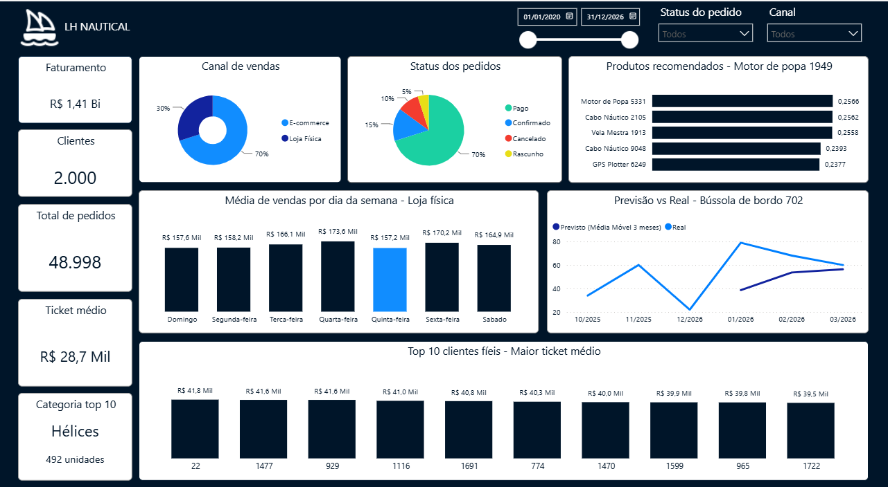

<div align="center">

# LH Nautical — Pipeline de Dados e Dashboard Analítico


<br>


</div>

<br>


## Sobre o Projeto

<p align="justify">
Este projeto consiste em uma análise de dados de ponta a ponta para a <b>LH Nautical</b>, uma empresa fictícia de varejo náutico com lojas físicas, e-commerce e operação de estoque. A empresa possuía 24 arquivos CSV brutos, sem estrutura de banco de dados e sem visão consolidada de vendas, clientes ou estoque.
</p>

<p align="justify">
Para resolver isso, construí um pipeline completo: um script Python que lê os CSVs e gera o schema do banco automaticamente, a carga dos dados em PostgreSQL, consultas SQL para responder às perguntas de negócio, modelos de Machine Learning para previsão de demanda e recomendação de produtos, e um dashboard interativo em Power BI para visualização geral dos números da empresa.
</p>

## Ferramentas Utilizadas

- **PostgreSQL**: Banco de dados relacional onde os 24 CSVs foram carregados, com schema gerado automaticamente a partir da inferência de tipos de cada coluna.
- **Python**: Geração do schema (`csv`, `os`, `datetime`), carga dos dados (`psycopg2`), modelo de previsão de demanda e sistema de recomendação (`pandas`, `scikit-learn`).
- **SQL**: Consultas com CTEs encadeadas para segmentação de clientes e uma dimensão de calendário construída do zero.
- **Microsoft Power BI**: Dashboard interativo conectado diretamente ao PostgreSQL, com relacionamentos reais entre tabelas e medidas DAX.
- **Microsoft Word / PowerPoint**: Relatório executivo e apresentação para stakeholders com os principais achados e recomendações.

## Entregáveis do Projeto

### 1. Dashboard Interativo
<p align="justify">
No dashboard encontram-se as principais métricas de vendas, clientes, estoque e os resultados dos modelos preditivos, com filtros por canal, status do pedido e período.
</p>

<div align="center">
  
  <br><br>
  <a href="./03_Dashboard/Dashboard.pbix">Acessar o arquivo do Dashboard (.pbix)</a>
</div>

<br>

### 2. Relatório Executivo

<p align="justify">
Documento voltado à diretoria, com diagnóstico de confiabilidade dos dados, os principais achados de negócio e recomendações de curto, médio e longo prazo.
</p>

[Confira aqui o Relatório Completo (.pdf)](./04_Relatorio/Relatorio_LH_Nautical.pdf)

### 3. Apresentação para Stakeholders
<p align="justify">
Versão em slides do relatório, estruturada para apresentação oral aos três principais interessados do negócio.
</p>

 [Confira aqui a Apresentação Executiva (.pdf)](./04_Relatorio/Apresentacao_LH_Nautical.pdf)

##  Principais Perguntas de Negócio

#### 1. Os dados são confiáveis para tomada de decisão?
<p align="justify">
Sim, com ressalvas conhecidas. A tabela de pedidos não apresenta duplicidade nem inconsistência aritmética. O único campo com valores em branco (vendedor associado) é estrutural — ocorre em 100% dos pedidos de e-commerce, canal que não possui vendedor. A ressalva relevante é que 14,9% dos pedidos são cancelamentos ou rascunhos e precisam ser excluídos de qualquer relatório de faturamento.
</p>

#### 2. Qual o pior dia da semana para vendas na loja física?
<p align="justify">
Quinta-feira, não domingo como uma análise anterior (mal calculada) apontava. O erro original ignorava dias em que a loja abriu e não vendeu nada, inflando artificialmente a média de domingo. Corrigindo o cálculo com uma dimensão de calendário completa, quinta-feira tem a menor média (R$ 157 mil) e quarta-feira a maior (R$ 173,6 mil) — uma diferença de apenas 10%, insuficiente para justificar o fechamento da loja em qualquer dia.
</p>

#### 3. Quem são os clientes mais valiosos e o que eles compram?
<p align="justify">
Os 10 clientes com maior ticket médio entre os que compram de 13 ou mais categorias distintas formam um grupo homogêneo: todos compram nas 14 categorias disponíveis, com ticket médio entre R$ 39,5 mil e R$ 41,8 mil. A categoria que mais compram é Hélices, com 492 unidades — um candidato natural para campanhas de venda cruzada.
</p>

#### 4. É possível prever a demanda de um produto antes de faltar estoque?
<p align="justify">
Um modelo baseline de média móvel (3 meses) foi testado no produto Bússola de Bordo 702. O erro médio absoluto foi de 19,44 unidades — o modelo acompanha bem períodos estáveis, mas erra em mais de 100% em picos súbitos de demanda, como o observado em janeiro/2026. Esse tipo de atraso explica rupturas de estoque como a relatada no cenário da empresa.
</p>

#### 5. É possível recomendar produtos com base no comportamento de compra?
<p align="justify">
Sim. Um motor de recomendação por similaridade de cosseno, construído a partir de uma matriz de interação cliente-produto, identificou os 5 produtos mais associados ao Motor de Popa 1949 (liderado por Motor de Popa 5331, similaridade de 0,2566). Os índices são baixos e próximos entre si, indicando um comportamento de compra disperso — o motor serve como apoio, não como regra única de recomendação.

  
## Estrutura do Repositório


```text
00_Zip/            -> Arquivo compactado dos dados originais
01_Dados_brutos/   -> Arquivos CSV de entrada
02_Scripts/        -> Scripts de automação Python, schema e consultas SQL
03_Dashboard/      -> Arquivo .pbix interativo do Power BI
04_Relatorio/      -> Imagens, relatório executivo e slides (.pdf)
```
## Como Executar o Projeto

1. **Clonar o repositório:**
   ```bash
   git clone [https://github.com/suzyanebr/lh-nautical-analytics.git](https://github.com/suzyanebr/lh-nautical-analytics.git)
   cd lh-nautical-analytics
